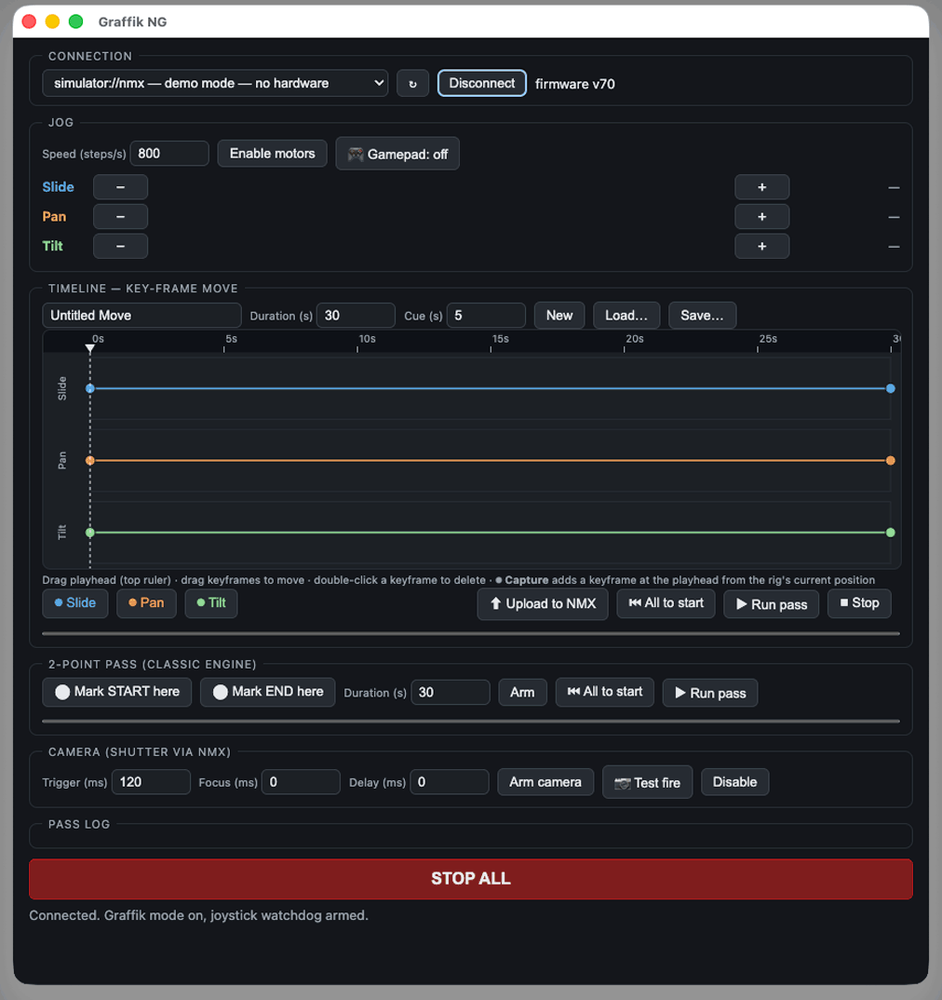

# Graffik NG

[](https://github.com/subvoyant/graffik-ng/actions/workflows/ci.yml)
[](LICENSE)

Modern, maintained software for driving the **Dynamic Perception NMX** 3-axis
motion controller — built for live-action, repeatable, multi-pass camera moves
(motion-control "multiplicity", where one performer appears several times in a
composited shot because the camera repeats its move exactly).



## What it does

- **Jog** slide / pan / tilt from on-screen buttons or any **game controller**
  (HTML5 Gamepad API — sticks map to the three axes, with deadzone and a
  watchdog-feeding heartbeat).
- **Key-frame timeline editor** — three tracks, draggable keyframes, playhead,
  undo/redo, numeric entry, arrow-key nudging. **⏺ Capture** adds a keyframe at
  the playhead from the rig's *current* position, so you frame the shot by
  jogging rather than typing numbers.
- **Curves you can trust.** The preview polyline is sampled from the *same*
  cubic-Hermite solver that programs the controller — what's drawn is what the
  firmware runs ([ADR-0009](docs/adr/0009-single-source-motion-math.md)).
- **Two motion engines**: the NMX key-frame engine for multi-point moves, and
  the classic program engine for simple 2-point A→B passes.
- **Pass manager** — cue countdown so the performer can reposition, timestamped
  pass log, per-engine pass counters.
- **Camera trigger** through the NMX shutter output (trigger / focus / delay,
  with a test-fire button).
- **Save & load moves** as versioned `.graffik` JSON
  ([ADR-0010](docs/adr/0010-film-file-format.md)) — human-diffable, and runnable
  headlessly by the CLI.
- **Demo mode** — a built-in NMX simulator that implements the firmware's
  dispatch semantics, so the entire workflow is usable and testable with **no
  hardware attached**.
- **Big red STOP ALL**, wired to broadcast stop for both engines and jumping the
  command queue.

## Status

Working software, **not yet exercised against physical hardware.** Every layer is
verified against the firmware's own published protocol documents, sample packets,
and dispatch source, plus 53 automated tests and an end-to-end simulator — but
first contact with a real NMX hasn't happened yet. Treat the first session with
motors accordingly: low speeds, nothing precious mounted, hand near STOP ALL.

## Quick start

```sh
cd packages/nmx-protocol && npm ci && npm test && npm run build
cd ../../apps/jog-slice && npm ci && npm start
```

Then pick **`simulator://nmx — demo mode`** in the port picker to explore with no
hardware, or plug in the NMX and choose its `/dev/tty.usbserial-*` port. See
[docs/DEVELOPMENT.md](docs/DEVELOPMENT.md) for the full setup, daily workflow,
packaging, and troubleshooting.

Headless runs (scripted shoots, hardware smoke tests):

```sh
cd packages/nmx-cli
node cli.js ports
node cli.js run my-move.graffik --port /dev/tty.usbserial-XXXX --passes 5
```

## Layout

- **`packages/nmx-protocol`** — headless TypeScript core: packet codec, the full
  command vocabulary (general / motors / camera / key-frame engine / broadcasts),
  a queued request-response client with an e-stop fast path, the Hermite spline
  solver, the `.graffik` schema, and the NMX simulator. **Zero runtime
  dependencies**; 53 tests, byte-exact against the firmware's own sample packets.
- **`packages/nmx-cli`** — headless runner: list ports, query firmware, run saved
  moves with cue countdowns and progress, e-stop.
- **`apps/jog-slice`** — the Electron app pictured above. All serial I/O lives in
  the main process; the renderer talks to hardware only through a narrow IPC
  surface ([ADR-0007](docs/adr/0007-serial-in-main-process-only.md)).

## Safety

- **STOP ALL** broadcasts stop to both the program engine and the key-frame
  engine, bypassing the command queue.
- The firmware's **joystick watchdog** is armed at connect: if the host stops
  talking mid-jog, the controller stops the motors on its own.
- Jog speed is hard-clamped host-side.
- **Programmed moves are blocked unless the controller reports firmware v70** —
  command numbers genuinely differ between firmware eras, and guessing would move
  motors in ways nobody intended ([ADR-0004](docs/adr/0004-firmware-dispatch-is-ground-truth.md)).
  Jog and status queries are never gated, so diagnosis always works.

## Multiplicity workflow

1. Connect → **Enable motors**.
2. Jog to the shot's opening framing → **⏺ Capture** on each axis at 0s.
3. Move the playhead, jog to the next framing, capture again. Repeat.
4. **⬆ Upload to NMX** — the controller stores the move.
5. Per pass: **⏮ All to start** → reposition the performer → **▶ Run pass**.
   The countdown clears the frame, and the controller replays the identical
   stored move every time.

Repeatability comes from the controller, not the host: the move is uploaded once
and executed on-device, so host timing never enters the picture
([ADR-0005](docs/adr/0005-determinism-lives-in-firmware.md)).

## Documentation

- [`docs/DEVELOPMENT.md`](docs/DEVELOPMENT.md) — setup, daily loop, packaging, troubleshooting
- [`docs/adr/`](docs/adr/README.md) — architecture decision records (the *why*)
- [`docs/digests/HUB.md`](docs/digests/HUB.md) — system map and invariants (the *how*)
- [`CONTRIBUTING.md`](CONTRIBUTING.md) — conventions and hard rules

## License and attribution

MIT — see [LICENSE](LICENSE).

Graffik NG is a spiritual successor to Dynamic Perception's abandoned Graffik
software and contains **no code from it**. The NMX protocol here is implemented
fresh from Dynamic Perception's published protocol documentation and the
observable behavior of their open-source firmware
([ADR-0003](docs/adr/0003-protocol-fresh-from-spec-mit.md)). Not affiliated with
Dynamic Perception, LLC — with gratitude for open-sourcing their firmware,
applications, and protocol documents, without which this project would not exist.
